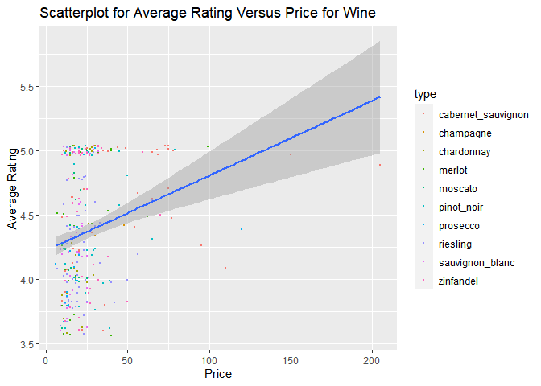
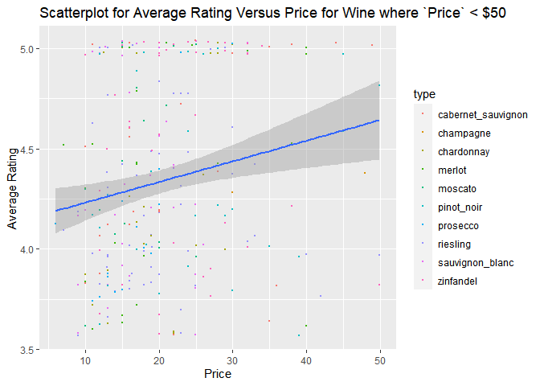

Project 2
================
Brant Armstrong, Lexi Field, Richard Xiao
2022-10-12

# **Purpose**

This github page will show the general methods used to create functions
that can call the Spoonacular API then clean the results before delving
into some exploratory data analysis using primarily tables and graphs.

# **Packages needed for our functions and data exploration**

``` r
library(tidyverse)
library(jsonlite)
```

# **Functions for Calling the Spoonacular API**

## Recipes by Cuisine Function

The first function we created is `get_recipes` which returns a list
containing recipes matching your search criteria along with their
nutrition information. The inputs are as follows:

-   `cuisine`: a string who can take on any values found
    [here.](https://spoonacular.com/food-api/docs#Cuisines)
-   `diet` : a string who can take on any values found
    [here.](https://spoonacular.com/food-api/docs#Diets)
-   `time` : the max number of minutes a recipe can take to prepare.
-   `number` : the maximum number of recipes to be returned; can be any
    number from 1 to 100.
-   `allergies` : a list that can contain any strings that match the
    values [here.](https://spoonacular.com/food-api/docs#Intolerances)
-   `API` : a string that matches the user’s API key.

``` r
get_recipes <- function(cuisine, diet = "N/A", time = 300, number = 100, allergies = "None", API = "05671e9eac144e52907ef1a7a7e37874"){
  #Checks diet and attaches it to url if not equal to the default of "N/A" while also attaching the rest of the inputs to the url
  if(diet == "N/A") {
    url <- paste0("https://api.spoonacular.com/recipes/complexSearch?apiKey=", API, "&cuisine=", cuisine,"&maxReadyTime=", time, "&number=", number, "&sort=random&addRecipeNutrition=true")
  } else{
    url <- paste0("https://api.spoonacular.com/recipes/complexSearch?apiKey=", API, "&cuisine=", cuisine, "&diet=", diet,"&maxReadyTime=", time,"&number=", number, "&sort=random&addRecipeNutrition=true")
  }
  #Changes allergies to a list and checks it against the list of accepted allergies and attaches it if valid.
  allergies <- as.list(allergies)
  allergens <- c("Dairy", "Egg", "Gluten", "Grain", "Peanut", "Seafood", "Sesame", "Shellfish", "Soy", "Sulfite", "Tree Nut", "Wheat")
  if(allergies[1] %in% allergens){
    #Attaching each allergy to the url.
    max = length(allergies)
   for(i in 1:max){
      url <- paste0(url, "&intolerances=", allergies[i])
    }
  }
  #Getting the relevant variables and adding two more for cuisine and diet matching the input.
  var_names <- c("pricePerServing", "id", "title", "readyInMinutes", "nutrition", "servings")
  recipe_list <- fromJSON(url)
  recipe_sample <- recipe_list$results %>% select(var_names) %>% mutate(Cuisine = cuisine, Diet = diet)
  return(recipe_sample)
}
```

## Cleaning Function for Recipes by Cuisine

Our `get_recipes` function has a small issue due to the nature of the
data return where all the nutrition information is nested as a dataframe
within the results. The `clean_nutrition` function takes the results
from `get_recipes` and returns a clean dataframe with all nutrition
information properly attached to each recipe observation.

``` r
clean_nutrition <- function(df){
  var_list <- c("Cuisine", "Diet", "id", "title","pricePerServing", "readyInMinutes", "name", "amount", "unit", "servings" )
  #Un-nesting the nutrition dataframe then un-nesting the nutrients dataframe from nutrition then taking only wants variables.
  df_long <- df %>% unnest(nutrition) %>% unnest(nutrients) %>% select(var_list)
  #Pivoting the dataframe so that each recipe is on a single row.
  df_wide <- df_long %>% pivot_wider(names_from = name, values_from = c(amount, unit ))
  return(df_wide)
}
```

## Wrapper Function for the Above Functions

Next, we created a wrapper function that can take in a list of cuisines
along with any relevant parameters then calls the `get_recipes` and
`clean_nutrition` functions for each supplied `cuisine` value and merges
the results into a single dataframe.

``` r
wrapper_recipes <- function(cuisine, diet = "N/A", time = 300, number = 100, allergies = "None", API = "965047400ad841198f2fd834535db269 " ){
  #Applying get_recipes to each cuisine in the supplied list
  cuisine_wrap <- lapply(cuisine, get_recipes, diet, time, number, allergies, API)
  #Applying clean_nutrition to the list of outputs from previous function.
  clean_wrap <- lapply(cuisine_wrap, clean_nutrition)
  #Bindind all the list elements together into a single dataframe.
  result_wrap <- bind_rows(clean_wrap)
  return(result_wrap)
}
```

## Matching Recipe Total Function

The following function `get_total` is a modified version of
`get_recipes` but instead of returning specific recipes that match our
results it instead gives us the total number of recipes in the
Spoonacular database that match our criteria.

``` r
get_total <- function(cuisine, diet = "N/A", time = 300, number = 100, allergies = "None", API = "05671e9eac144e52907ef1a7a7e37874"){
  #Checks diet and attaches it to url if not equal to the default of "N/A" while also attaching the rest of the inputs to the url
  if(diet == "N/A") {
    url <- paste0("https://api.spoonacular.com/recipes/complexSearch?apiKey=", API, "&cuisine=", cuisine,"&maxReadyTime=", time, "&number=", number, "&sort=random&addRecipeNutrition=true")
  } else{
    url <- paste0("https://api.spoonacular.com/recipes/complexSearch?apiKey=", API, "&cuisine=", cuisine, "&diet=", diet,"&maxReadyTime=", time,"&number=", number, "&sort=random&addRecipeNutrition=true")
  }
  #Changes allergies to a list and checks it against the list of accepted allergies and attaches it if valid.
  allergies <- as.list(allergies)
  allergens <- c("Dairy", "Egg", "Gluten", "Grain", "Peanut", "Seafood", "Sesame", "Shellfish", "Soy", "Sulfite", "Tree Nut", "Wheat")
  if(allergies[1] %in% allergens){
    #Attaching each allergy to the url.
    max = length(allergies)
   for(i in 1:max){
      url <- paste0(url, "&intolerances=", allergies[i])
    }
  }
  recipe_list <- fromJSON(url)
  #Taking instead the totalResults output and renaming the default created "...1" column to Total
  #Still creates a variable for cuisine and diet based on inputs
  recipe_total <- recipe_list$totalResults %>% bind_cols() %>% rename(Total = ...1)%>% mutate(Cuisine = cuisine, Diet = diet)
  return(recipe_total)
}
```

## Wine Recommendation Function

The `get_wine` function returns recommended wines based upon your search
criteria. The inputs are as follows:

-   `type` : a string for the kind of wine wanted that can take values
    found [here.](https://spoonacular.com/food-api/docs#Wine-Guide)
-   `price` : the maximum price for wine.
-   `number` : the maximum number of wines to return; can be any number
    from 1 to 100.
-   `API` : a string that matches the user’s API key.

``` r
get_wine <- function(type, price = 6000, number = 100, API = "2ab6d276479a4f6eb30b1b7ab0524e6d"){
  #Simply adds each input to the url
  url <- paste0("https://api.spoonacular.com/food/wine/recommendation?apiKey=", API, "&wine=", type, "&maxPrice=", price, "&number=", number)
  wine_list <- fromJSON(url)
  #Selecting only the results wanted
  #Grabbing the wanted variables
  #Converting averageRating to to a 0-5 scale and turning price into a numeric variable
  wine_rec <- wine_list$recommendedWines %>% 
    select(id, price, averageRating, ratingCount, score) %>% 
    mutate(type = type, averageRating = averageRating * 5, price = parse_number(price))
  return(wine_rec)
}
```

## Meal Plan Function

the `get_plan` function returns a list containing the meal plan based
upon your search criteria along with the macro nutrients for each day.
The inputs are as follows:

-   `time` : a string that can be either “day” or “week”
-   `calories` : a number for your daily caloric goal
-   `diet` : a string who can take on any values found
    [here.](https://spoonacular.com/food-api/docs#Diets)
-   `allergies` : a list that can contain any strings that match the
    values [here.](https://spoonacular.com/food-api/docs#Intolerances)
-   `API` : a string that matches the user’s API key.

``` r
#Outputs a list containing multiple dataframes. Should combine to one dataframe.
get_plan <- function(time = "week", calories, diet = "N/A", allergies = "None", API = "965047400ad841198f2fd834535db269"){
    #Checks diet and attaches it to url if not equal to the default of "N/A" while also attaching the rest of the inputs to the url
    if(diet == "N/A") {
    url <- paste0("https://api.spoonacular.com/mealplanner/generate?apiKey=", API, "&timeFrame=", time,"&targetCalories=", calories)
  } else{
    url <- paste0("https://api.spoonacular.com/mealplanner/generate?apiKey=", API, "&timeFrame=", time, "&diet=", diet,"&targetCalories=", calories)
  }
  #Changes allergies to a list and checks it against the list of accepted allergies and attaches it if valid.
  allergies <- as.list(allergies)
  allergens <- c("Dairy", "Egg", "Gluten", "Grain", "Peanut", "Seafood", "Sesame", "Shellfish", "Soy", "Sulfite", "Tree Nut", "Wheat")
  if(allergies[1] %in% allergens){
   #Attaching each allergy to the url
   max = length(allergies)
   for(i in 1:max){
      url <- paste0(url, "&exclude=", allergies[i])
    }
  }
  meal_plan <- fromJSON(url)
  
  #Checking if time is week or day and returning the matching output
  if(time == "week"){
    #Combining all the separate meal lists to one dataframe
    meal_df <- bind_rows(meal_plan$week$monday$meals, meal_plan$week$tuesday$meals, meal_plan$week$wednesday$meals, meal_plan$week$thursday$meals, meal_plan$week$friday$meals, meal_plan$week$saturday$meals, meal_plan$week$sunday$meals)
    #Combining all the separate nutrients lists into one dataframe and added a column for what day they correspond to
    days <- c("Monday", "Tuesday", "Wednesday", "Thursday", "Friday", "Saturday", "Sunday")
    nutrition_df <- bind_rows(meal_plan$week$monday$nutrients, meal_plan$week$tuesday$nutrients, meal_plan$week$wednesday$nutrients, meal_plan$week$thursday$nutrients, meal_plan$week$friday$nutrients, meal_plan$week$saturday$nutrients, meal_plan$week$sunday$nutrients) 
    nutrition_df$Day <- days
  } else {
    #For when the selection is day just gives a single set of meals and nutrients.
    meal_df <- bind_rows(meal_plan$meals)
    nutrition_df <- bind_rows(meal_plan$nutrients)
  }
  #Returns a list: one element is all the meals for the week/day and the other element is the macro nutrients for each day.
  return(list(meals = meal_df, nutrition = nutrition_df))
}
```

## Recipes by Macros

The `get_macros` function returns a dataframe of recipes matching your
search criteria but uses nutrition information distinguishing it from
`get_recipes`. The inputs are as follows:

-   `min_calories` : the minimum calories per recipe.
-   `max_calories` : the maximum calories per recipe.
-   `min_protein` : the minimum grams of protein per recipe.
-   `max_protein` : the maximum grams of protein per recipe.
-   `number` : the maximum number of recipes to return; can be any
    number from 1 to 100.
-   `random` : TRUE or FALSE to return a random sample of recipes
    matching your criteria.
-   `API` : a string that matches the user’s API key.

``` r
get_macros <- function(min_calories = 0, max_calories = 2000, min_protein = 0, max_protein = 700, number = 20, random = TRUE,API = "ca0e515fe1024fd489a76a3d88fcb775"){
    #adds all the inputs to the url
    url <- paste0("https://api.spoonacular.com/recipes/findByNutrients?apiKey=", API, "&minCalories=", min_calories, "&maxCalories=", max_calories, "&minProtein=", min_protein, "&maxProtein=",max_protein, "&number=", number, "&random=", random)
    calories_list <- fromJSON(url)
    #selects only the columns we are interested in
    new_calories_list <- calories_list%>%select(id, title, calories,protein,fat,carbs)
  return(new_calories_list)
}
```

# **Exploratory Data Analysis**

## Cuisine Analysis

### Function Calls

We begin by calling `wrapper_recipes` with a list of ten popular
cuisines to create a dataframe then calling the `get_total` function for
seven popular cuisines across six common diets and combining them.
Ideally, we would have used the same ten cuisines for each but API quota
limitations forced us to reduce the size for our `get_total` calls.

``` r
cuisine_list <- c("American", "Chinese", "French", "Greek", "Indian", "Italian","Japanese", "Mexican", "Middle Eastern", "Korean")
cuisine_rec_df <- wrapper_recipes(cuisine_list, number = 100, API = "965047400ad841198f2fd834535db269")

diet_list <- c("Gluten Free","Ketogenic","Vegetarian","Vegan","Paleo", "Whole30")
Italian_totals <- diet_list %>% lapply(get_total, cuisine="Italian", API ="00f6eb3644b14db584ee4dd635b6dc77" ) %>% bind_rows()
American_totals <- diet_list %>% lapply(get_total, cuisine="American", API ="00f6eb3644b14db584ee4dd635b6dc77" ) %>% bind_rows()
Chinese_totals <- diet_list %>% lapply(get_total, cuisine="Chinese", API ="00f6eb3644b14db584ee4dd635b6dc77" ) %>% bind_rows()
French_totals <- diet_list %>% lapply(get_total, cuisine="French", API ="00f6eb3644b14db584ee4dd635b6dc77" ) %>% bind_rows()
Mexican_totals <- diet_list %>% lapply(get_total, cuisine="Mexican", API ="00f6eb3644b14db584ee4dd635b6dc77" ) %>% bind_rows()
Indian_totals <- diet_list %>% lapply(get_total, cuisine="Indian", API ="00f6eb3644b14db584ee4dd635b6dc77" ) %>% bind_rows()
Japanese_totals <- diet_list %>% lapply(get_total, cuisine="Japanese", API ="00f6eb3644b14db584ee4dd635b6dc77" ) %>% bind_rows()
true_totals <- bind_rows(Italian_totals, American_totals, Chinese_totals, French_totals, Mexican_totals, Indian_totals, Japanese_totals )
```

### Contingency Tables

In preparation for these tables we created three categorical variables:
`fat_content`, `protein_content`, and `carb_content` which are
categorized as follows:

-   Content \>= 30 grams -\> `"High"`
-   Content \>= 15 grams -\> `"Medium"`
-   Content \>= 30 grams -\> `"Low"`

We then created three contingency tables showing the amount of recipes
that fall into each category for each `cuisine`.

``` r
fat_content_df <- cuisine_rec_df %>% select(Cuisine, amount_Fat) %>% mutate(fat_content = if_else(amount_Fat >= 30, "High", if_else(amount_Fat >= 15, "Medium", "Low")))
protein_content_df <- cuisine_rec_df %>% select(Cuisine, amount_Protein) %>% mutate(protein_content = if_else(amount_Protein >= 30,      "High", if_else(amount_Protein >= 15, "Medium", "Low")))
carb_content_df <- cuisine_rec_df %>% select(Cuisine, amount_Carbohydrates) %>% mutate(carb_content = if_else(amount_Carbohydrates >= 30, "High", if_else(amount_Carbohydrates >= 15, "Medium", "Low")))
fat_table <- table(fat_content_df$Cuisine, fat_content_df$fat_content)
protein_table <- table(protein_content_df$Cuisine, protein_content_df$protein_content)
carb_table <- table(carb_content_df$Cuisine, carb_content_df$carb_content)
names(dimnames(fat_table)) <- c("Cuisine", "Fat Content")
names(dimnames(protein_table)) <- c("Cuisine", "Protein Content")
names(dimnames(carb_table)) <- c("Cuisine", "Carbohydrate Content")
```

``` r
fat_table
```

    ##                 Fat Content
    ## Cuisine          High Low Medium
    ##   American         26  45     29
    ##   Chinese           7  34      4
    ##   French           21  19     29
    ##   Greek            20  50     30
    ##   Indian           20  41     39
    ##   Italian          26  46     28
    ##   Japanese         14  59     27
    ##   Korean            4  13      7
    ##   Mexican          18  55     27
    ##   Middle Eastern    7  19     11

As evidenced by the tables, there is not an equal number of observations
for each cuisine. It seems that the Spoonacular API is lacking when it
comes to Korean and Middle Eastern recipes in particular. Furthermore,
focusing on the fat content table we see that most recipes fall into the
`"Low"` category. It’s difficult to say if this is due to the innate
characteristics of each `cuisine` or if Spoonacular has a selection
method for adding recipes to its API that tries to filter out fatty
recipes. Of the `cuisine` categories with a significant number of
observations, Italian and French `cuisine` stand out as having a large
proportion of their recipes fall into the `"High"` or `"Medium"`
category while Chinese `cuisine` is more concentrated in the `"Low"`
category relative to other options.

``` r
protein_table
```

    ##                 Protein Content
    ## Cuisine          High Low Medium
    ##   American         20  59     21
    ##   Chinese           8  28      9
    ##   French            6  48     15
    ##   Greek            19  64     17
    ##   Indian           24  49     27
    ##   Italian          24  45     31
    ##   Japanese         10  78     12
    ##   Korean            9  10      5
    ##   Mexican          20  61     19
    ##   Middle Eastern    4  29      4

Next, for protein we see a similar over representation of the `"Low"`
category. If one was interested in trying to prioritize recipes with a
fair amount of protein then they would be best served by looking into
American, Indian, and Italian recipes while minimizing Greek and Mexican
recipes.

``` r
carb_table
```

    ##                 Carbohydrate Content
    ## Cuisine          High Low Medium
    ##   American         64  13     23
    ##   Chinese          20  16      9
    ##   French           27  18     24
    ##   Greek            48  30     22
    ##   Indian           34  31     35
    ##   Italian          61  17     22
    ##   Japanese         44  33     23
    ##   Korean           14   6      4
    ##   Mexican          44  29     27
    ##   Middle Eastern   14  13     10

Finally, for carbohydrates the vast majority of recipes fall into the
`"High"` category. This is not particularly surprising as in most
cultures carbohydrates make up a majority of their caloric intake.
Italian cuisine stands out as an outlier with very large proportion of
their recipes falling into the `"High"` category which is no surprise
due to their penchant for pasta and bread.

The contingency table for `cuisine` and `diet` was created by simply
pivotting the combined data from our `get_total` function calls.

``` r
wide_totals <- pivot_wider(true_totals, names_from = Diet, values_from = Total)
wide_totals
```

    ## # A tibble: 7 × 7
    ##   Cuisine  `Gluten Free` Ketogenic Vegetarian Vegan Paleo Whole30
    ##   <chr>            <int>     <int>      <int> <int> <int>   <int>
    ## 1 Italian             83         1         55    21     6       7
    ## 2 American           112         4        110    22     9      12
    ## 3 Chinese             24         0         10     5     0       0
    ## 4 French              22         0         31     3     1       3
    ## 5 Mexican           2714        68       2207   667   281     370
    ## 6 Indian              96         3         55    26     5      18
    ## 7 Japanese          2714        68       2207   667   281     370

The results of this table lead us to believe that there may be something
wrong with the API when it comes to diets and their interaction with
Mexican and Japanese `cuisine`. They both have the exact same values for
each column and are massively larger than any other category. We
verified the functions were called properly and the results remained so
if there is an issue causing this we believe it to be on the API side as
all the others returned normal results and the only thing changed
between them is the `cuisine` inputs which match the guide on the
website [here.](https://spoonacular.com/food-api/docs#Cuisines).

### Graphs and Plots

We begin by creating separate box plots for the grams of fat,
carbohydrates, and protein for each `cuisine`.

``` r
ggplot(cuisine_rec_df, aes(x= Cuisine, y=amount_Fat, col = Cuisine)) + 
  geom_boxplot(fill="grey") + 
  geom_jitter() +
  ylab("Grams of Fat") + 
  theme(axis.text.x = element_text(angle = 45)) +
  ggtitle("Boxplot for Grams of Fat by Cuisine")
```

<!-- --> Here we can
see that almost every `cuisine` has a fair quantity of outliers in fat
content outside of the Korean and Indian recipes. With Middle Eastern
`cuisine` having the most extreme outliers in terms of magnitude. Also,
mirroring the results of our contingency tables, we see that French and
Italian `cuisine` have the highest median fat content while Chinese
`cuisine` has the lowest median.

``` r
ggplot(cuisine_rec_df, aes(x = Cuisine, y=amount_Protein, col = Cuisine)) + 
  geom_boxplot(fill="grey") + 
  geom_jitter() + 
  ylab("Grams of Protein") + 
  theme(axis.text.x = element_text(angle = 45)) +
  ggtitle("Boxplot for Grams of Protein by Cuisine")
```

<!-- --> Here we see
a similar story in terms of outliers with most `cuisine` options having
a fair number of recipes that have significantly more protein content
than the median. This time French and Korean `cuisine` have the least
observations falling into that outlier category. Meanwhile, American and
Mexican food have the most extreme outliers in terms of magnitude while
French has the tightest distribution of protein content. Additionally,
Korean and American `cuisine` standout as having significantly a larger
IQR relative to other categories.

``` r
ggplot(cuisine_rec_df, aes(x = Cuisine, y=amount_Carbohydrates, col = Cuisine)) +
  geom_boxplot(fill="grey") + 
  geom_jitter() + 
  ylab("Grams of Carbohydrates") + 
  theme(axis.text.x = element_text(angle = 45)) +
  ggtitle("Boxplot for Grams of Carbohydrates by Cuisine")
```

<!-- --> Immediately,
it becomes clear that Chinese and Korean `cuisine` have the most extreme
outliers in terms of magnitude when it comes to carbohydrate content. Of
all the categories, Italian stands out as having a fairly tight and
symmetric distribution of carbohydrate content compared to the others
with American or Mexican `cuisine` being the closest competitors in that
regard.

Finally, we constructed a bar plot by grouping our data by `cuisine`
then creating a variable for the average time to prepare for each
`cuisine`.

``` r
cuisine_bar <- cuisine_rec_df %>% group_by(Cuisine) %>% summarize(Average_Time = mean(readyInMinutes))
ggplot(cuisine_bar, aes(x = Cuisine, y = Average_Time, fill = Cuisine)) + 
  geom_bar(stat = "Identity")  + 
  ylab("Average Time to Prepare") + 
  theme(axis.text.x = element_text(angle = 45)) +
  ggtitle("Average Time to Prepare by Cuisine")
```

<!-- --> French
`cuisine` takes the longest time to prepare on average, followed closely
by American and Greek `Cuisine`. Indian `cuisine` has the shortest
average preparation but is still fairly close to the others. Based on
the graph, the average time to prepare does not seem to vary greatly
across different values of `cuisine`.

## Wine Analysis

To Begin we called the `get_wine` function for 10 different popular
wines then combined the results into one dataframe for analysis.

``` r
wine_list <- c("merlot", "riesling","chardonnay", "sauvignon_blanc", "pinot_noir", "cabernet_sauvignon", "moscato", "champagne", "prosecco", "zinfandel")
wine_rec_df <-wine_list %>%
  lapply(get_wine) %>%
  bind_rows()
```

### Wine Summary Statistics Table

We began by creating a table of summary statistics for `price` at each
`type` of wine.

``` r
wine_rec_df %>% group_by(type) %>% summarise(avg_price = mean(price, na.rm = TRUE), median_price = median(price, na.rm = TRUE), std_dev = sd(price, na.rm = TRUE), IQR = IQR(price, na.rm = TRUE))
```

    ## # A tibble: 10 × 5
    ##    type               avg_price median_price std_dev   IQR
    ##    <chr>                  <dbl>        <dbl>   <dbl> <dbl>
    ##  1 cabernet_sauvignon      49.0         36.0   40.4  51.9 
    ##  2 champagne               39.0         39.0   12.7   9   
    ##  3 chardonnay              19.8         18.5    6.29 10.5 
    ##  4 merlot                  25.3         17.0   20.2  18.0 
    ##  5 moscato                 17.1         16.1    4.73  5.51
    ##  6 pinot_noir              30.0         25.0   17.7  18.9 
    ##  7 prosecco                22.3         15.0   25.7   7   
    ##  8 riesling                21.7         19.0   12.2  11   
    ##  9 sauvignon_blanc         18.0         17      5.80  8   
    ## 10 zinfandel               25.1         22.0   12.3  11.5

Cabernet Sauvignon stands out as the `type` of wine that has the highest
average `price` by a significant margin along with the largest standard
deviation and IQR which tells us there is a large spread in possible
values. Moscato has the lowest standard deviation and IQR so along with
a median close to the average `price` so it should have a fairly tight
distribution with Sauvignon Blanc being close behind. Also noteworthy is
that the average `price` for every `type` is larger than their median.

### Wine Scatterplot

``` r
gwine <- ggplot(data = wine_rec_df, aes(x = price, y = averageRating,))
gwine + geom_point(aes(color = type), position = "jitter", size = .5) + 
  xlab("Price") + 
  ylab("Average Rating") +
  ggtitle("Scatterplot for Average Rating Versus Price for Wine") +
  geom_smooth(method = lm)
```

<!-- --> Initially,
we assumed that we would see a fairly strong relationship between the
average rating of a wine and its `price`. However, while our graph does
suggest that there is a relationship based upon our prediction line, it
looks like this could be primarily due to a few outliers and is not
actually effective in predicting rating for most of our data. As can
clearly be seen, there is a lot of variance in that zero to fifty dollar
range that just looking at the graph does not suggest much of a
relationship. Therefore we decided to filter our dataset to only wines
under fifty dollars then rerun our graph.

``` r
filtered_wine_rec_df <- wine_rec_df %>% filter(price < 50)

gwine <- ggplot(data = filtered_wine_rec_df, aes(x = price, y = averageRating,))
gwine + geom_point(aes(color = type), position = "jitter", size = .5) + 
  xlab("Price") + 
  ylab("Average Rating") +
  ggtitle("Scatterplot for Average Rating Versus Price for Wine where `Price` < $50") +
  geom_smooth(method = lm)
```

<!-- --> As you can
see, the results stayed roughly the same but the slope of our line seems
to decrease suggesting a weaker relationship between average rating and
`pric`. Once again, the relationship is not nearly as strong as we
anticipated. This could be due to the fact that all of our wines are in
the 3.5 to 5.0 range. It’s possible that Spoonacular is intentionally
removing poorly rated wines and is therefore giving us a sample that is
not truly representative of the population and obscuring the true
relationship if there is one. Or simply, there might not really be a
strong relationship between the `price` of a wine and it’s average
rating.

### Wine Boxplot

Next, we wanted to look at the difference in average rating across the
different categories of wine so we created a box plot.

``` r
gwinerating <- ggplot(data = wine_rec_df, aes(x = type, y = averageRating, color = type))
gwinerating + geom_boxplot(fill = "grey") + 
  geom_point(aes(color = type), position = "jitter", size = 1) +  
  xlab("Type of Wine") + 
  ylab("Average Rating") + 
  theme(axis.text.x = element_text(angle = 45)) +
  ggtitle("Box Plot for Average Rating by Type")
```

<!-- --> As shown in
the plot, there were only a few champagne wines in the data frame with
average ratings close together so the box is small. Zinfandel and
Cabernet Sauvignon have the highest medians suggesting that maybe
critics favor that type of wine. Cabernet Sauvignon and Prosecco have
the largest outliers in terms of magnitude with their most extreme
observation being a fair distance away from the median with Cabernet’s
being lower and Prosecco’s being higher. In addition, all wines outside
of Champagne have at least one observation with an average rating of 5.

### Wine Histogram

``` r
ggplot(wine_rec_df, aes(x=averageRating, fill = type, color = type)) + 
  geom_histogram(binwidth = 1, position="dodge") + 
  xlab("Average Rating") + 
  ylab("Frequency") +
  ggtitle("Histogram of Average Ratings for Wine (Position = dodge)")
```

<!-- --> Before
looking at the graph, it’s important to note that for readability we
used `dodge` to separate the bars for each wine in this histogram and
have a bin width of 1. Simply put, this means that when you see the pink
Zinfandel bar over in that 5.5 average rating area it does not mean they
were actually rated above a 5. That is simply the frequency of Zinfandel
wines that have an average rating between 4.5 and 5.

Now, based upon this histogram, we can see that average rating of
Rieslings is strongly clustered into that 3.5 to 4.5 bar mirroring the
results of our previous box plot. Meanwhile, the Cabernet Sauvignons and
Zinfadels are clustered almost equally at the lower end in the 3.5 to
4.5 and in the 4.5 to 5.5 sections suggesting reviewers tended to either
have strong positive opinions or were rather lukewarm on them.
